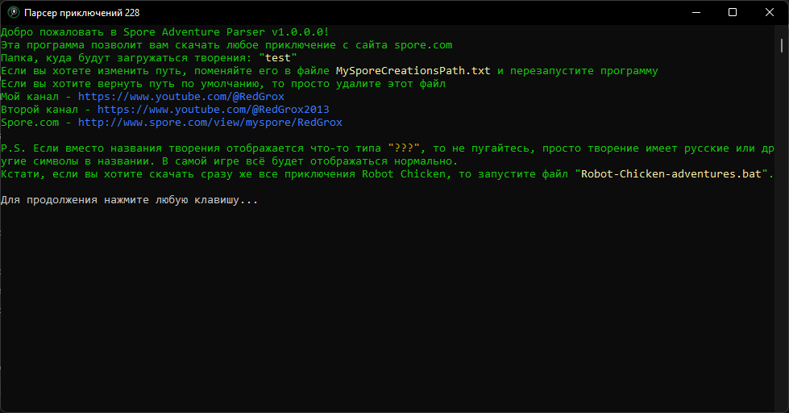

# Adventure Parser

Программа для загрузки приключений для игры Spore GA и всех творений для них.

В будущем сделаю нормальный интерфейс, а пока он консольный

---

## Использование

Чтобы использовать скачать приключения, сделайте следующие действия:

* Запустите `SporeAdventureParser.exe`
* Введите ссылку или ID приключения, например: `http://www.spore.com/sporepedia#qry=usr-RedGrox%7C501074940839%3Asast-501105481257` или `501105481257`
* Дождитесь окончание загрузки
* Запустите Spore

### Приключения Robot Chicken

Если вы хотите скачать сразу же все приключения Robot Chicken, то запустите файл `Robot-Chicken-adventures.bat`

### Подводные камни

Иногда Spore по какой-то причине отказывается загружать творения, хотя они есть в папке `Мои творения`. В таком случае, вы можете изменить папку, куда будут сохранятся творения и просто перетащить их в окно Spore, чтобы они появились в игре. Для этого отредактируйте файл `MySporeCreationsPath.txt`, который появляется после первого запуска программы.

---

## Самореклама

Чтобы не пропустить обновления, вы можете подписаться на мои соцсети:

* [YouTube (основной канал)](https://www.youtube.com/@RedGrox)
* [YouTube (второй канал)](https://www.youtube.com/@RedGrox2013)
* [Телеграм](https://t.me/SporeRedGroxMods)
* [Spore.com](http://www.spore.com/view/myspore/RedGrox)

## SporeAPI

Для создания этой программы, использовался [SporeAPI](http://www.spore.com/comm/developer/). Для этого я начал делать свою библеотеку, если её можно так назвать (пока я её не доделал). Вы можете использовать её в своих целях, для этого скомпилируйте проект `SporeAPI`. Если я доделаю эту штуку, то возможно я перенесу её в отдельный репозиторий.
